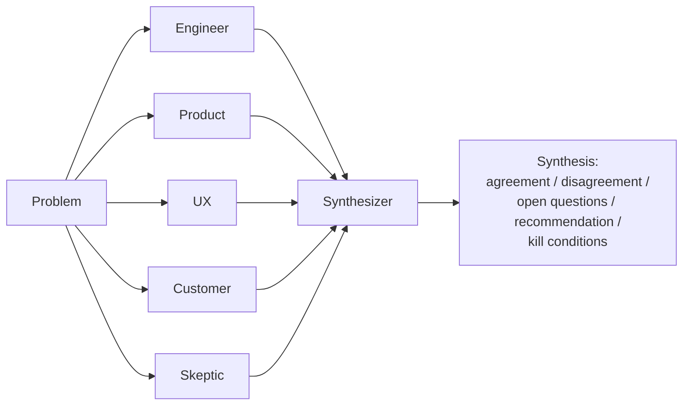

# mastra-deliberation

A product/technical decision goes in; five specialist agents evaluate it **in
parallel**; a synthesizer agent reduces their (often conflicting) views into
a single structured decision brief. Started as a small, finished Mastra
prototype — agents, parallel workflow steps, structured output, and tracing —
and now also has a real browser UI ([below](#web-ui-deliberation-lab)) that
drives the same workflow live, with per-specialist retry when a call fails.



## Sample output

Run against [`problems/example.md`](./problems/example.md) (a usage-based
billing decision):

```json
{
  "agreement": [
    "Metering and billing infrastructure will add operational complexity and reconciliation risk that requires careful implementation",
    "Power users (top 5%) represent disproportionate value and pose significant churn risk if the change is poorly communicated or executed",
    "Real-time usage visibility and transparent communication are critical to customer satisfaction and retention",
    "The underlying cost problem is real (80/20 split), but the solution must address customer retention economics alongside infrastructure savings",
    "A grace period or transition mechanism for existing customers is necessary to avoid trust damage and legal friction",
    "The overage pricing threshold and billing mechanics must be validated with actual customers before launch, not assumed"
  ],
  "disagreement": [
    {
      "topic": "Whether metered billing for power users is fundamentally viable for this product",
      "sides": [
        "Conditional support (Technical Lead, PM, UX, CS): can work with grace periods, transparent communication, and pre-launch validation of willingness-to-pay",
        "Opposition (Skeptic): the assumption that power users accept metered limits without churning is unvalidated; margin gains will be offset by churn of highest-LTV accounts"
      ]
    }
  ],
  "openQuestions": [
    "Have you surveyed the top 5% power users about acceptable overage pricing, or are you inferring acceptance?",
    "What churn probability among power users would make this initiative net-negative?"
  ],
  "recommendation": "Delay launch 4-6 weeks to validate pricing with real power users and model churn-vs-savings before committing.",
  "killConditions": [
    "Customer research reveals >10% stated churn intent among power users if limits are enforced",
    "Technical audit shows metering infrastructure needs >8 weeks of unplanned work"
  ]
}
```

## Trace screenshot


## What I noticed

I built this to specifically exercise Mastra's parallel workflow steps and
tracing together, and ran into a real gap between them: calling
`agent.generate()` with custom logic inside a step's `execute()` function —
which is the normal case, since you almost always need to build a prompt
from `inputData` — produces a **disconnected root trace** for that agent
call instead of a child span nested under the workflow's trace, unless you
manually thread `tracingContext` from the step's execute params into the
`generate()` call yourself. Tool steps and the `createStep(someAgent)`
shorthand get this wired up automatically; a custom `execute()` doesn't, and
nothing warns you — the five parallel branches just silently show up as five
unrelated traces instead of one legible parallel-execution tree. I wondered
whether `createStep` could propagate `tracingContext` into any agent/tool
call made inside a custom `execute()` the same way it already does for the
shorthand form, since the custom-`execute()` case is the one most real
workflows will actually use.

See [`NOTES.md`](./NOTES.md) for the full friction log, including how this
was diagnosed and verified (not just suspected).

## Mastra concepts used

- **Agents** (`@mastra/core/agent`) — five specialists plus a synthesizer, each a plain `new Agent({ instructions, model })`.
- **Workflows** (`createWorkflow` / `createStep`) — one step per specialist feeding a synthesis step.
- **Parallel steps** (`.parallel([...])`) — the five specialist steps run concurrently; output is combined and keyed by step id.
- **Structured output** (`agent.generate(prompt, { structuredOutput: { schema } })`) — every agent call is validated against a Zod schema (`SpecialistView` or `Synthesis`).
- **Tracing/observability** (`@mastra/observability`, `LibSQLStore`) — every run is visible as a nested trace tree in `mastra dev`'s Studio.
- **Retries** (`retries` on each step) — a transient failure is retried by the workflow itself before ever surfacing to a caller.
- **Client SDK** (`@mastra/client-js`) — the browser UI drives a live run via `workflow.createRun().stream(...)`, reading `workflow-step-start`/`workflow-step-result` events, and calls individual agents directly (`mastraClient.getAgent(id).generate(...)`) for the retry path described below.

## How to run

```bash
npm install
cp .env.example .env   # set MODEL and the matching provider API key
npm run deliberate     # runs the workflow against problems/example.md, prints the Synthesis

npm run dev             # separately: starts Studio at http://localhost:4111 to inspect traces
```

## Web UI (Deliberation Lab)

`src/web/` is a Vite + React UI that runs a real `deliberation` workflow against whatever problem you type, and shows the five specialists completing independently before the synthesis appears. It talks to the Mastra server over HTTP (`@mastra/client-js`), so it needs **two processes running at once**:

```bash
npm run dev      # terminal 1: the Mastra server (needs ANTHROPIC_API_KEY in .env)
npm run dev:ui   # terminal 2: the Vite UI
```

The UI reads the server's URL from `VITE_MASTRA_API_URL` in `.env` (defaults to `http://localhost:4111`, matching `npm run dev`'s default port) — set it if you're pointing at a different Mastra server.

A transient failure (dropped connection, momentary rate limit) is retried automatically by the workflow itself, invisibly. If a specialist's call still fails, its card shows a "Retry" action that calls that one specialist directly without discarding the other four; the synthesis panel gets the same treatment if it fails after all five succeed. Either recovery path calls the relevant agent directly rather than re-running the whole workflow, so nothing that already succeeded is thrown away.
